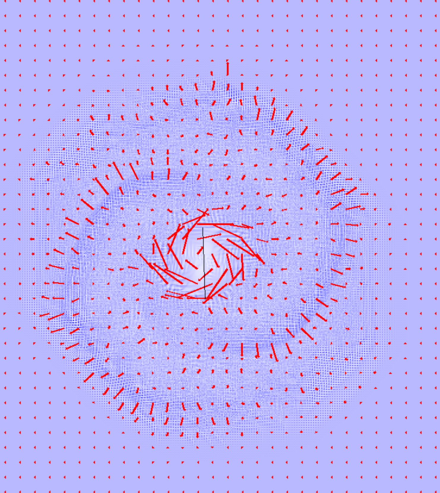

A WIP project to simulate the movement of a sailboat, with a keel in the water and a sail in the air. The program approximates Navier-Stokes partial differential equations from computational fluid dynamics with 3 grids of float values, storing velocity and density of a fluid. The TensorFlow library is used to optimize everything as much as possible.

Inspired by these papers:
1. [_The Story of Airplane Wings_](https://arxiv.org/abs/2010.07446)
2. [_Real-Time Fluid Dynamics for Games_](http://graphics.cs.cmu.edu/nsp/course/15-464/Fall09/papers/StamFluidforGames.pdf)

Required libraries:
1. `numpy`
2. `pygame`
3. `pymunk`
4. `TensorFlow`
5. `skimage` (`scikit-image`)
